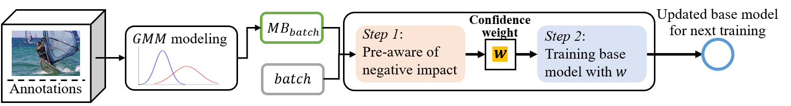
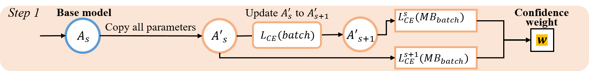
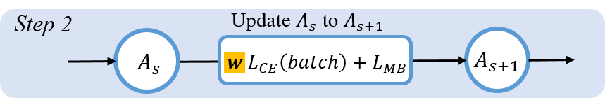
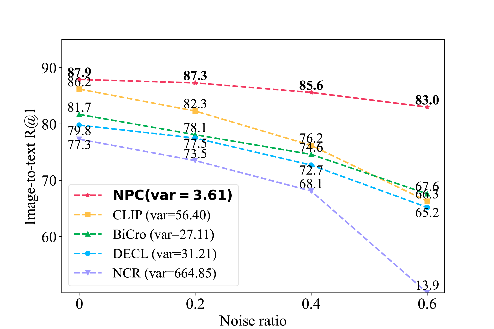

## Introduction

This is a PyTorch implementation for the AAAI 2024 paper ["Negative Pre-aware for Noisy Cross-Modal Matching"](http://arxiv.org/abs/2312.05777). Our method **NPC** is built on top of the [CLIP](https://arxiv.org/abs/2103.00020) in PyTorch for end-to-end Image-text Matching. 


In *Step 1*, we calculate the negative impact of each sample via the siamese model *A'* of base model *A*.


In *Step 2*, we train the base model *A* with the re-weight samples and memory bank.


The proposed NPC achieves much better accuracy (higher R@1) and higher robustness (lower variance among R@1).


## Requirements
* python 3.7
* [numpy](http://www.numpy.org/) 1.21.6 (> 1.19.5)
* [torch](http://pytorch.org/) 1.13.1
* [tensorboard](https://github.com/TeamHG-Memex/tensorboard_logger) 2.11.2

```bash
pip install requirments.txt
```

## Data Preparation
#### Split Dataset
We conducted experiments on three datasets: MSCOCO, Flickr30K, and CC120K. We followed [SCAN](https://github.com/kuanghuei/SCAN) to split image-text pairs in MSCOCO and FLickr30K into training, validation and testing sets. 
* **MSCOCO.**
We unified the images' name format of the MSCOCO dataset for easier use. You can use `dataset/MSCOCO_rename.py` to rename the images in MSCOCO. [(MSCOCO_2014)](https://cocodataset.org/#home)
* **Flickr30K.**
[(Flickr30K)](https://shannon.cs.illinois.edu/DenotationGraph/data/index.html).
* **CC120K.**
We tested the proposed method on the real-world dataset [Conceptual Captions](http://ai.google.com/research/ConceptualCaptions). Since the full dataset is too large, we randomly selected a subset of Conceptual Captions, named CC120K, including 118,851 images for training, 1,000 for validation, and 1,000 for testing. You can download the dataset from [here](https://pan.baidu.com/s/152gNGgScGSMgSXu8i8o-dg) with the code "3ble".

#### Construct Noisy Datasets
We constructed noise by randomly shuffling some captions of the images. 

You can obtain your noisy dataset using `construct_noise.py`. And we also integrated this part of the code in `data.py`. The noisy dataset will be automatically constructed and saved during training when it doesn't exist. 

Since there are around 3%-20% incorrect annotations existing in the real-world dataset Conceptual Captions, we did not create noisy samples manually.

#### Frozen Memory Bank
We provide the frozen Memory Bank that appeared in the paper for the datasets with different noise ratios. If you want to update them during training, please use `get_memorybank.py`.

#### Note!
If you want to use your own noisy dataset for training, the Memory Bank should also be rebuilt. You can construct the noise dataset by `construct_noise.py`, and obtain the Memory Bank by `get_memorybank.py`.

#### Download Link
* [MSCOCO](https://drive.google.com/drive/folders/1VULI0Pxa4Turimkndpb7LoXP34wEGmtS?usp=sharing)
* [Flickr30K](https://drive.google.com/drive/folders/1VULI0Pxa4Turimkndpb7LoXP34wEGmtS?usp=sharing)
* [CC120K](https://drive.google.com/drive/folders/1VULI0Pxa4Turimkndpb7LoXP34wEGmtS?usp=sharing)

The final data directory tree should be:
```
├── dataset/
├── ${DATASET_NAME}/
|    ├── annotations/
|    |   ├── frozen_memory_bank/
|    |   |   ├── ${noise_ratio}_mbank_img_idx.npy
|    |   |   ├── ${noise_ratio}_mbank_txt_idx.npy
|    |   |   └── ...
|    |   └──scan_split/
|    |       ├── ${noise_ratio}_noise_train_caps.txt #samples use for training. ${noise_ration} is in {0, 0.2, 0.4, 0.6}
|    |       ├── train_caps.txt # the same as `0_noise_train_caps.txt`
|    |       ├── train_ids.txt 
|    |       ├── dev_caps.txt #samples use for validation
|    |       ├── dev_ids.txt 
|    |       ├── test_caps.txt #samples use for testing
|    |       ├── test_ids.txt 
|    |       └── ...
|    └── images/ # all images in MSCOCO (or Flickr30K, CC120K)
└── ...
```

## Models and Evaluation
You can download the models fine-tuned using NPC(ours) and CLIP(our baseline) from this [link](https://drive.google.com/drive/folders/12ZW5CGvzfDMU_NDlx44HZS3cyVAlgtq5?usp=sharing).

Save the models in folder `./pre-trained_models`, and evaluate the models via the following command. For example, evaluate the models trained on MSCOCO with 60% noise.

```bash
python main_NPC.py --eval --resume /AAAI24-NPC/pre-trained_models/npc_coco_60.pt --dataset_root /AAAI24-NPC/dataset/MSCOCO --dataset coco
```
```bash
python main_CLIP.py --eval --resume /AAAI24-NPC/pre-trained_models/clip_coco_60.pt --dataset_root /AAAI24-NPC/dataset/MSCOCO --dataset coco
```
* Experiment results on MSCOCO 1K and 5K.
<table>
   <tr> <td rowspan="3">Noise Ratio</td> <td rowspan="3", align="center">Method</td> 
        <td colspan="6", align="center">MSCOCO 1K</td> <td colspan="6", align="center">MSCOCO 5K</td>
    </tr>
   <tr> <td colspan="3", align="center">Image-to-Text</td> <td colspan="3", align="center">Text-to-Image</td>
        <td colspan="3", align="center">Image-to-Text</td> <td colspan="3", align="center">Text-to-Image</td> </tr>
   <tr> <td>R@1</td><td>R@5</td><td>R@10</td> <td>R@1</td><td>R@5</td><td>R@10</td><td>R@1</td><td>R@5</td><td>R@10</td> <td>R@1</td><td>R@5</td><td>R@10</td></tr>
   
   <tr> <td rowspan="2", align="center">0%</td>
        <td>CLIP</td> <td>79.9</td><td>95.1</td><td>98.1</td> <td>65.0</td><td>90.3</td><td>98.1</td> 
                <td>62.2</td><td>84.6</td><td>90.9</td> <td>45.1</td><td>72.3</td><td>81.8</td> 
   </tr>
   <tr> <td>NPC</td> <td>82.2</td><td>96.5</td><td>98.7</td> <td>68.3</td><td>92.0</td><td>98.7</td>
                     <td>65.4</td><td>87.3</td><td>93.1</td> <td>48.5</td><td>75.4</td><td>84.4</td> 
   </tr>
   
   <tr> <td rowspan="2", align="center">20%</td>
        <td>CLIP</td> <td>75.0</td><td>93.1</td><td>97.2</td> <td>58.7</td><td>86.1</td><td>97.2</td> 
                      <td>55.5</td><td>80.3</td><td>87.8</td> <td>38.8</td><td>65.5</td><td>75.7</td> 
   </tr>
   <tr> <td>NPC</td> <td>79.9</td><td>95.9</td><td>98.4</td> <td>66.3</td><td>90.8</td><td>98.4</td> 
                     <td>61.6</td><td>85.4</td><td>91.6</td> <td>46.0</td><td>73.4</td><td>82.9</td> 
   </tr>
   
   <tr> <td rowspan="2", align="center">40%</td>
        <td>CLIP</td> <td>70.7</td><td>91.7</td><td>96.2</td> <td>54.7</td><td>83.4</td><td>96.2</td> 
                      <td>51.6</td><td>76.1</td><td>84.7</td> <td>35.3</td><td>61.3</td><td>72.1</td>
   </tr>
   <tr> <td>NPC</td> <td>79.4</td><td>95.1</td><td>98.3</td> <td>65.0</td><td>90.1</td><td>98.3</td> 
                     <td>61.3</td><td>84.7</td><td>90.6</td> <td>44.7</td><td>72.2</td><td>81.7</td> 
   </tr>

   <tr> <td rowspan="2", align="center">50%</td>
        <td>CLIP</td> <td>69.0</td><td>90.6</td><td>95.8</td> <td>52.8</td><td>82.0</td><td>95.8</td> 
                      <td>49.0</td><td>74.5</td><td>83.0</td> <td>33.7</td><td>59.1</td><td>70.1</td>
   </tr>
   <tr> <td>NPC</td> <td>78.5</td><td>95.0</td><td>98.1</td> <td>64.1</td><td>89.6</td><td>98.1</td> 
                     <td>60.1</td><td>83.5</td><td>90.4</td> <td>43.6</td><td>71.1</td><td>80.9</td> 
   </tr>

   <tr> <td rowspan="2", align="center">60%</td>
        <td>CLIP</td> <td>67.0</td><td>88.8</td><td>95.0</td> <td>49.7</td><td>79.6</td><td>95.0</td> 
                      <td>45.1</td><td>71.5</td><td>80.9</td> <td>30.9</td><td>55.6</td><td>66.9</td> 
   </tr>
   <tr> <td>NPC</td> <td>78.2</td><td>94.4</td><td>97.7</td> <td>63.1</td><td>89.0</td><td>97.7</td> 
                     <td>59.9</td><td>82.9</td><td>89.7</td> <td>43.0</td><td>70.2</td><td>80.0</td> 
   </tr>
     
</table>

* Experiment results on Flickr30K.
<table>
   <tr> <td rowspan="2">Noise Ratio</td> <td rowspan="2", align="center">Method</td> 
        <td colspan="3", align="center">Image-to-Text</td> <td colspan="3", align="center">Text-to-Image</td>
    </tr>
   <tr> <td>R@1</td><td>R@5</td><td>R@10</td> <td>R@1</td><td>R@5</td><td>R@10</td></tr>
   
   <tr> <td rowspan="2", align="center">0%</td>
        <td>CLIP</td> <td>86.2</td><td>97.6</td><td>99.2</td> <td>72.9</td><td>92.3</td><td>96.0</td> 
   </tr>
   <tr> <td>NPC</td> <td>87.9</td><td>98.1</td><td>99.4</td> <td>75.0</td><td>93.7</td><td>97.2</td>
   </tr>
   
   <tr> <td rowspan="2", align="center">20%</td>
        <td>CLIP</td> <td>82.3</td><td>95.5</td><td>98.3</td> <td>66.0</td><td>88.5</td><td>93.5</td> 
   </tr>
   <tr> <td>NPC</td> <td>87.3</td><td>97.5</td><td>98.8</td> <td>72.9</td><td>92.1</td><td>95.8</td>
   </tr>
   
   <tr> <td rowspan="2", align="center">40%</td>
        <td>CLIP</td> <td>76.2</td><td>93.3</td><td>96.5</td> <td>59.4</td><td>85.0</td><td>90.9</td> 
   </tr>
   <tr> <td>NPC</td> <td>85.6</td><td>97.5</td><td>98.4</td> <td>71.3</td><td>91.3</td><td>95.3</td>
   </tr>

   <tr> <td rowspan="2", align="center">60%</td>
        <td>CLIP</td> <td>66.3</td><td>87.3</td><td>93.0</td> <td>52.1</td><td>78.8</td><td>87.4</td> 
   </tr>
   <tr> <td>NPC</td> <td>83.0</td><td>95.9</td><td>98.6</td> <td>68.1</td><td>89.6</td><td>94.2</td>
   </tr>
     
</table>

* Experiment results on CC120K.
<table>
   <tr> <td rowspan="2", align="center">Method</td> 
        <td colspan="3", align="center">Image-to-Text</td> <td colspan="3", align="center">Text-to-Image</td>
    </tr>
   <tr> <td>R@1</td><td>R@5</td><td>R@10</td> <td>R@1</td><td>R@5</td><td>R@10</td></tr>
   
   <tr> 
        <td>CLIP</td> <td>68.8</td><td>87.0</td><td>92.9</td> <td>67.8</td><td>86.4</td><td>90.9</td> 
   </tr>
   <tr> <td>NPC</td> <td>71.1</td><td>92.0</td><td>96.2</td> <td>73.0</td><td>90.5</td><td>94.8</td>
   </tr>
   
   </tr>
     
</table>


## Training
**For training NPC**
You can train a new model via the following command. Before training, you can read the `params.py` carefully to check your parameter setting. The `--num_anns` should be set to 5 for MSCOCO and Flickr30K, and 1 for CC120K.

```bash
python main_NPC.py --batch_size 256 --epochs 5 --lr 2e-7 --vision_model ViT-B/32 --noise_ratio ${NOISE RATIO} --num_anns ${5 or 1} --dataset_root ${YOUR PATH} --dataset coco --checkpoint_path ${YOUR PATH}
```

**For training CLIP**
Thanks to this [project](https://github.com/leolee99/CLIP_ITM) for providing a basic fine-tuning framework of CLIP. We have improved the code of the data loading process and the model evaluation. The `--num_anns` should be set to 5 for MSCOCO and Flickr30K, and 1 for CC120K. You can fine-tune the CLIP via the following command. 
```bash
python main_CLIP.py --batch_size 256 --epochs 5 --lr 5e-7 --vision_model ViT-B/32 --noise_ratio ${NOISE RATIO} --num_anns ${5 or 1} --dataset_root ${YOUR PATH} --dataset coco --checkpoint_path ${YOUR PATH}
```

## Reference
If our proposed NPC is helpful for you, welcome to cite the following paper. :smiley:

@inproceedings{NPC,\
  author    = {Xu Zhang and Hao Li and Mang Ye},\
  title     = {Negative Pre-aware for Noisy Cross-Modal Matching},\
  booktitle = {AAAI},\
  year      = {2024}\
}
